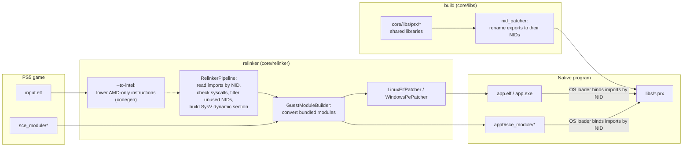
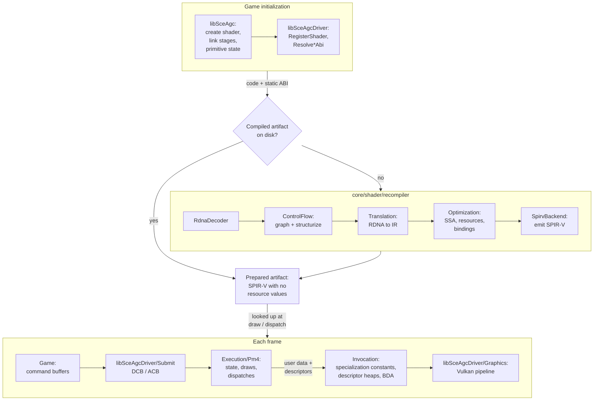

# Architecture

How a PS5 executable becomes a native Linux or Windows program. Nothing is emulated: the converted executable runs as a normal process and calls native implementations of the system libraries.

## Overview

- [`core/relinker/main.cpp`](../../core/relinker/main.cpp) runs the steps in this order. `--to-intel` is optional, see [USAGE.md](../user/USAGE.md).
- Each library in [`core/libs/prx`](../../core/libs/prx) builds as a shared library. After the build, `nid_patcher` ([`core/libs/nid`](../../core/libs/nid)) renames every export to its NID, computed from the function name. `APS5_EXPORT("<nid>", func)` sets the NID directly when the name is unknown.

## Graphics

- Shaders are compiled when the game registers them, not when they are first drawn. [`ShaderRegistry.cpp`](../../core/libs/prx/libSceAgcDriver/Execution/src/Driver/Shaders/ShaderRegistry.cpp) runs `Driver::RegisterShader` for every shader the game creates, and `Resolve*Abi` when libSceAgc links stages or sets the primitive state. Each one compiles the artifact for that static ABI (stage, wave size, push constant layout, linked stages).
- An artifact does not depend on the resources bound at draw time. The shader reads them at runtime, as on the PS5: buffers, images and samplers from descriptor arrays and typed heaps indexed at runtime, and user data from the shader data block defined in [`RuntimeAbi.hpp`](../../core/shader/recompiler/RuntimeAbi.hpp).
- At a draw or dispatch, the driver looks up the prepared artifact and fails if there is none. Only compute shaders the game never registered are compiled at that point. The draw supplies the invocation: the specialization constants listed in [`PipelineSpecialization.hpp`](../../core/shader/recompiler/PipelineSpecialization.hpp), the descriptors and the push constants. Each distinct set of constants produces one specialized SPIR-V module, kept in memory.
- [`Recompiler.cpp`](../../core/shader/recompiler/Recompiler.cpp) runs the stages in this order. With `ANYPS5_ENABLE_SPIRV_TOOLS`, the SPIR-V is also validated and optimized with SPIRV-Tools. `ShaderDiskCache` stores the artifacts on disk so later runs skip the recompilation.
