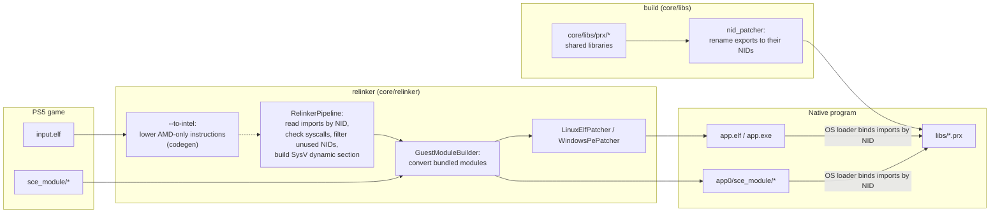
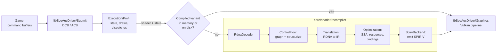

# Architecture

How a PS5 executable becomes a native Linux or Windows program. Nothing is emulated: the converted executable runs as a normal process and calls native implementations of the system libraries.

## Overview

- [`core/relinker/main.cpp`](../../core/relinker/main.cpp) runs the steps in this order. `--to-intel` is optional, see [USAGE.md](../user/USAGE.md).
- Each library in [`core/libs/prx`](../../core/libs/prx) builds as a shared library. After the build, `nid_patcher` ([`core/libs/nid`](../../core/libs/nid)) renames every export to its NID, computed from the function name. `APS5_EXPORT("<nid>", func)` sets the NID directly when the name is unknown.

## Graphics

- [`Recompiler.cpp`](../../core/shader/recompiler/Recompiler.cpp) runs the stages in this order. With `ANYPS5_ENABLE_SPIRV_TOOLS`, the SPIR-V is also validated and optimized with SPIRV-Tools.
- `ShaderRecompiler::Recompile` keeps compiled variants in memory, and `ShaderDiskCache` stores them on disk so later runs reuse them.
